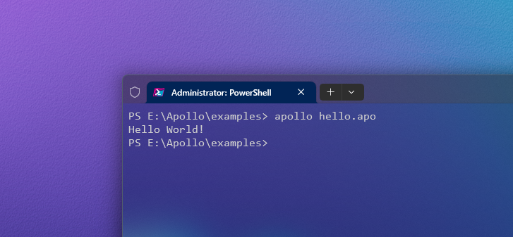

# Apollo

Apollo 灵活和高效的编程体验。该项目包含了 Apollo 编程语言的第一个版本的编译器前端。

## 特性

- [文档](docs/features.md)

## 环境变量

1. 将 `bin` 目录添加到系统的 `PATH` 环境变量中。
2. 创建一个名为 `APOLLO_HOME` 的系统全局变量，并将其值设置为 Apollo 项目的 `bin` 目录。
3. 创建一个名为 `APOLLO_MEMORY` 的系统全局变量，并将其值设置为 `acm` 目录的路径（用于指向 ACM 内存空间）。
4. 创建一个名为 `APOLLO_INCLUDE` 的系统全局变量，并将其值设置为 `include` 目录的路径（用于链接内联实现）。

## 构建二进制可执行文件

1. 安装依赖和工具：
   - 确保您的系统为 Windows 10 及以上版本。
   - 安装 Chocolatey 然后执行：
        ```powershell
        choco install winflexbison
        ```
   - LLVM 16 clang++、Python 3.x。
   - Visual Studio Installer 中安装 C++ 标准库。(如果选择非 MSVC 的 C++ 标准库，可能需要修改部分代码 - 用宏指令来兼容函数调用)

2. 克隆项目到本地:

    ```powershell
    git clone 'https://github.com/scientist-loki/Apollo.git'
    ```

3. 进入项目目录:

    ```powershell
    cd apollo\bin
    ```

4. 编译和构建 Apollo 编译器前端:

    ```powershell
    .\build
    ```

5. 切换到 examples 目录:

    ```powershell
    cd ..
    cd examples
    ```

6. 运行示例代码:

    ```powershell
    apollo hello.apo
    ```

详细使用指南，请参考项目中的 [文档](docs/start.md) 。

## 示例

下面是一个简单的 Apollo 代码示例，用于输出 "Hello World!"：

```apollo
def main ()
{
    out: 'Hello World!';   // The support for the print function is coming soon.
}

main();
```


更多示例代码和详细说明，请参考 [示例目录](examples/) 。

## 聊天

想与 Apollo 社区的其他成员聊天吗？

选择以下方式：
- 微信 [Apollo 中文社区交流群](ress/wechat_group_g1.jpg)

## 开发与贡献

- 如果没错的话，每个代码文件的头部都会放置一个共享版权声明。其中包含如下内容：
-  * Thanks to the following contributors for their dedication and support of this project:
- 您可以按照自身意愿将名字追加在最后一个名字的下一行，例如 `- Alice` 。

我们欢迎您为 Apollo 编程语言项目做出贡献！如果您有任何建议、问题或修复，请通过 GitHub 的 issue 系统提交。

## 开源许可证

该项目基于 [Apache 2.0 许可证](license/LICENSE-Apollo) 进行发布和分发。

